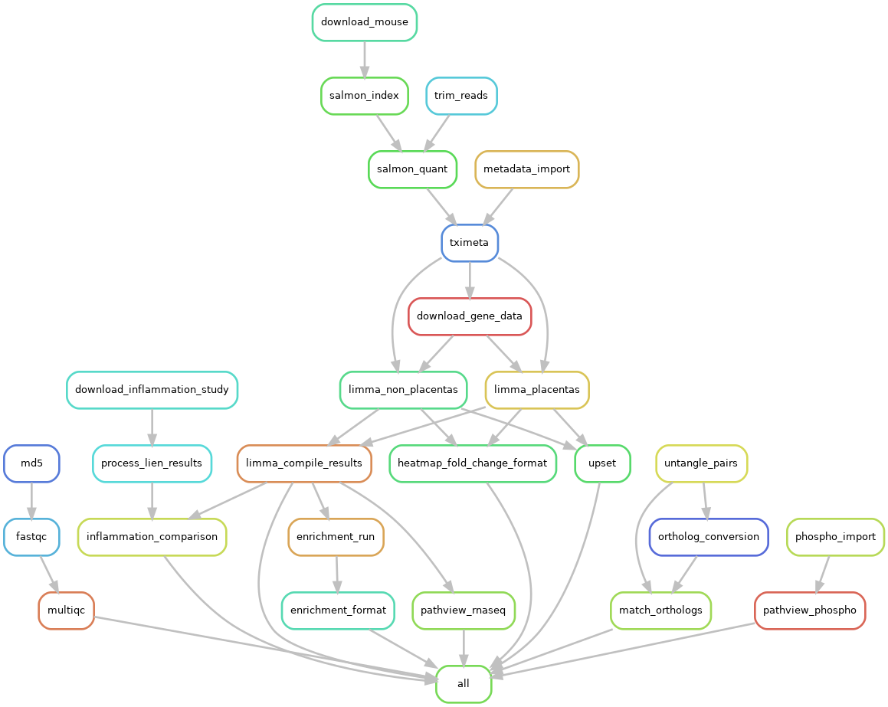

# INFLAMMATION_TRANSFER
Analysis of RNAseq data for inflammation in pregnant mice and fetuses

## DAG of the workflow

Created with the command `snakemake --rulegraph | dot -Tpng > dag.png` since we have too many files to visualize the entire workflow.

Current process includes sha5 check for file integrity, followed by fastqc and multiqc aggregation. 
The results of the QC procedure are available as an htlm report [here](reports/multiqc/multiqc.html).

The only quality adjustment required is trimming the first 11 bases to avoid adapter bias.
We work off the GENCODE mouse genome version 38 and transcriptome version 23.

## How to implement the pipeline
The pipeline requires an installed snakemake environment.  
In order to install all required software, install [conda](https://snakemake.readthedocs.io/en/stable/getting_started/installation.html) on your system and then use the command

`conda env create -f env/pymake.yaml`

Please remember to activate the environment with 

`conda activate pymake`

before running the pipeline.
